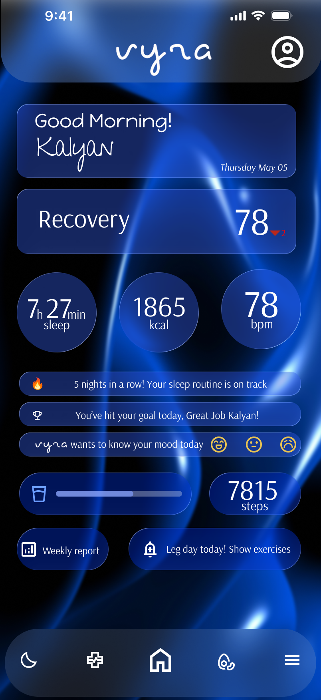
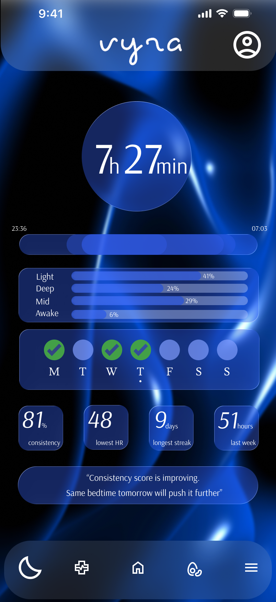
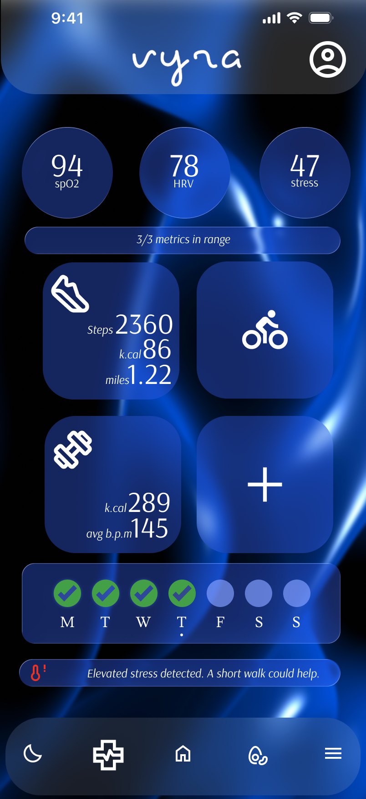
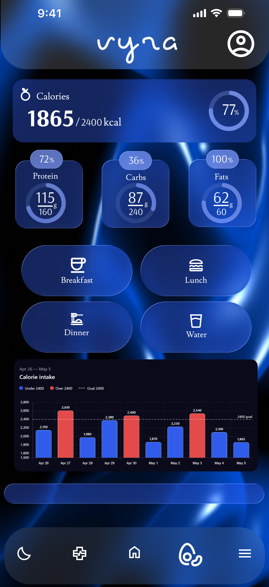
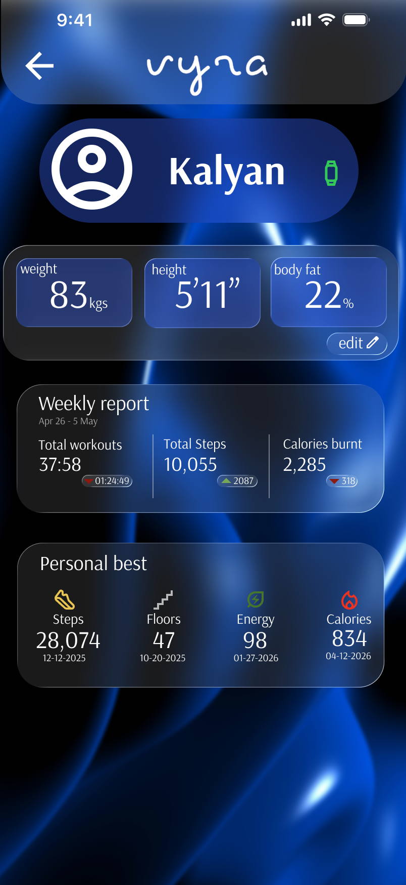

# vyra-health-tracking-system-ux

A high-fidelity UX concept for a mobile health tracking app,
designed in Figma as part of the Google UX Design Certificate.

## 🔗 Figma Prototype
[View Full Prototype](https://www.figma.com/design/JI4UPm8e58wcNTraV2zCtn/vyra?node-id=0-1&t=VvYJTnYbhAVvTYdY-1)

## 📱 Screens
| Home | Sleep | Health | Food | Profile |
|------|-------|--------|------|---------|
|  |  |  |  |  |

## 🎯 Problem
Most health apps are cluttered and overwhelming.
Vyra was designed to make health data feel human,
actionable, and beautiful.

## ✨ Key Design Decisions
- Glassmorphism cards for depth without visual noise
- AI-style contextual nudges based on real data
- One-thumb usability across all screens
- Consistency scoring that rewards habits over intensity

## 🛠 Tools Used
- Figma (Wireframing, Prototyping, High-fidelity UI)
- Google UX Design Certificate

## 📊 Screens Overview
- **Home** — Recovery score, daily stats, mood check-in
- **Sleep** — Deep/light breakdown, consistency score, streaks
- **Health** — SpO2, HRV, stress, steps, real-time alerts
- **Food** — Calorie & macro tracking, meal logging
- **Profile** — Weekly reports, personal bests, body metrics
- **Menu** — Goal setting, vitals, app sync
